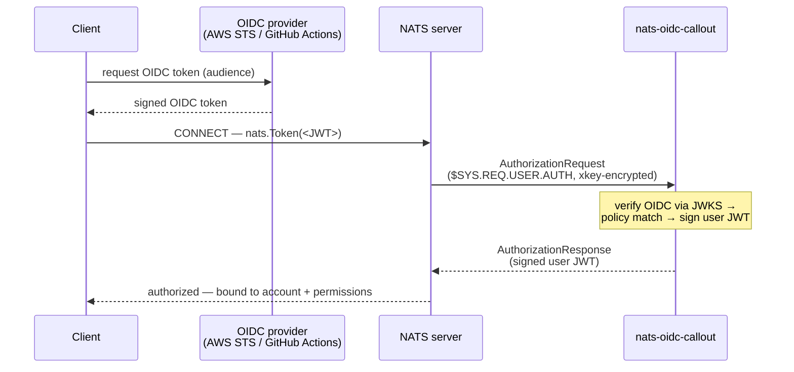

# nats-oidc-callout

A [NATS auth callout](https://docs.nats.io/running-a-nats-service/configuration/securing_nats/auth_callout)
service that authenticates NATS clients using **OIDC tokens** from any trusted
issuer — including **AWS Web Identity Tokens** (STS
[`GetWebIdentityToken`](https://docs.aws.amazon.com/STS/latest/APIReference/API_GetWebIdentityToken.html),
AWS *outbound web identity federation*) and **GitHub Actions** OIDC tokens.

A client obtains a short-lived, signed OIDC token for its identity and passes it
as the NATS connection token. This service verifies the token against the
issuer's published JWKS, maps the identity to a NATS account and permissions via
a policy file (matching on arbitrary verified claims), and returns a signed NATS
user JWT.

## How it works



1. The client obtains an OIDC token (e.g.
   `aws sts get-web-identity-token --audience <aud> --signing-algorithm RS256`,
   or a GitHub Actions ID token) and connects with it (`nats.Token(jwt)`).
2. The NATS server delegates auth to this service over `$SYS.REQ.USER.AUTH`
   (encrypted with an xkey).
3. The service:
   - selects a **trusted issuer** by exact `iss` match (never discovers an
     unconfigured issuer),
   - verifies the signature against the issuer's JWKS with a **signing-algorithm
     allowlist**, plus `exp`/`nbf` and an explicit **audience allowlist**,
   - binds the issuer to **required claim values** (`require_claims`),
   - evaluates the **policy** (ordered rules over `issuer`, `sub`, and arbitrary
     flattened `claims`) to pick a NATS account + permissions,
   - issues a user JWT bound to the server-supplied user nkey, with its expiry
     capped to the token's expiry.

## Build / install

```sh
go build ./cmd/nats-oidc-callout
# or download a release archive / container image (ghcr.io/sylr/nats-oidc-callout)
```

**Packages (deb/rpm).** Releases also ship `.deb` and `.rpm` packages that install
the binary to `/usr/bin`, a **systemd unit** to `/usr/lib/systemd/system/nats-oidc-callout.service`,
and config templates to `/etc/nats-oidc-callout/{config,policy}.yaml` (preserved on
upgrade). They create a `nats-oidc-callout` system user; the service is **not**
auto-started — edit the config first, then:

```sh
sudo systemctl enable --now nats-oidc-callout
```

## Configure

Generate the keys the server and service share (using the NATS `nk` tool). With
`-pubout`, `nk -gen` prints **two lines**: the seed first, then its public key.

```sh
go install github.com/nats-io/nkeys/nk@latest   # install the nk tool

nk -gen account -pubout   # line 1: account seed (SA…)  → issuer_account_seed
                          # line 2: account public (A…) → auth_callout.issuer
nk -gen curve -pubout     # line 1: curve seed   (SX…)  → xkey_seed
                          # line 2: curve public (X…)   → auth_callout.xkey
```

To derive the public key from a seed you already have (e.g. one stored in your
secret store), feed the seed back in with `-inkey … -pubout`:

```sh
printf '%s' "$ISSUER_ACCOUNT_SEED" > account.seed
nk -inkey account.seed -pubout    # → account public key (A…)
```

- Put the **public** account key in the server's `auth_callout.issuer` and the
  **public** curve key in `auth_callout.xkey` (see [`examples/server.conf`](examples/server.conf)).
- Put the corresponding **seeds** in the service config `issuer_account_seed` /
  `xkey_seed` (see [`examples/config.yaml`](examples/config.yaml)). Keep seeds in
  a secret store; never commit them.

Define authorization in a policy file ([`examples/policy.yaml`](examples/policy.yaml)).
Rules are evaluated in order; the first match wins; no match denies.

Run:

```sh
nats-oidc-callout -config examples/config.yaml
```

## AWS setup (real tokens)

Outbound web identity federation must be enabled on the account, and the calling
principal needs `sts:GetWebIdentityToken`:

```sh
aws iam enable-outbound-web-identity-federation   # one-time, per account
```

```json
{
  "Effect": "Allow",
  "Action": "sts:GetWebIdentityToken",
  "Resource": "*",
  "Condition": {
    "ForAllValues:StringEquals": { "sts:IdentityTokenAudience": "nats://callout-e2e" },
    "NumericLessThanEquals": { "sts:DurationSeconds": 300 }
  }
}
```

Find your account's issuer URL (use it in `issuers[].url`):

```sh
aws iam get-outbound-web-identity-federation-info
```

> `GetWebIdentityToken` is **not** available on the STS global endpoint — set a
> region (`AWS_REGION` / `--region`).

## GitHub Actions

GitHub issues every workflow job (with `permissions: id-token: write`) a
short-lived OIDC token. It's a standard OIDC token from issuer
`https://token.actions.githubusercontent.com`, with top-level claims like
`repository`, `repository_owner`, `repository_id`, `ref`, and `sub`
(`repo:OWNER/REPO:…`). Configure it like any other issuer:

```yaml
issuers:
  - url: "https://token.actions.githubusercontent.com"
    require_claims: { repository_owner: "your-org" }
```

```yaml
# policy
- match:
    issuer: "https://token.actions.githubusercontent.com"
    claims: { repository: "your-org/your-repo" }   # pin the repo, not just the owner
  grant: { account: APP, subscribe: { allow: ["telemetry.>"] } }
```

> **Trust scoping:** GitHub's issuer is shared across *all* of GitHub.
> `require_claims: {repository_owner}` only excludes other owners — **pin
> `repository` (or the immutable `repository_id`) in the policy**, or the rule is
> rejected as broad. Names can be renamed/transferred, so prefer the immutable
> `*_id` claims; the default `sub` shape also varies (branch/PR/environment/
> custom/immutable subjects), so match on `repository` rather than `sub`.

## Client libraries

Two small, dependency-light Go helpers package the client side — obtaining a
token for the right identity and handing it to the NATS Go SDK. Each is a
**separate nested module** (so importing one pulls only its own dependencies,
not the callout server's), versioned with subdirectory-prefixed tags
(`lib/awsauth/vX.Y.Z`, `lib/k8sauth/vX.Y.Z`):

| Module | Token source | Depends on |
| --- | --- | --- |
| [`lib/awsauth`](lib/awsauth) | STS `GetWebIdentityToken` (mints on demand) | `aws-sdk-go-v2` (config + sts), `nats.go` |
| [`lib/k8sauth`](lib/k8sauth) | projected service-account token file (kubelet-rotated) | `nats.go` only |

Both expose the same shape: `Token(ctx) (string, error)` for the raw token, and
`NATSOption(...)` returning a `nats.Option`. The option uses
[`nats.TokenHandler`](https://pkg.go.dev/github.com/nats-io/nats.go#TokenHandler),
so a **fresh token is supplied on every (re)connect** — which is the only refresh
path, since the callout runs solely at CONNECT and the user JWT it issues is
capped to the token's expiry (see [How it works](#how-it-works)). Keep
reconnection enabled (the nats.go default) for long-lived connections; a failed
fetch is recorded on `LastError()`.

### `lib/awsauth`

```go
import (
	"github.com/nats-io/nats.go"
	"github.com/sylr/nats-oidc-callout/lib/awsauth"
)

// Audience must match the callout's audience allowlist; a region must resolve
// (GetWebIdentityToken is not on the STS global endpoint). Optional CachePath
// reuses the token across separate processes — e.g. successive `nats` CLI runs.
cachePath, _ := awsauth.DefaultCachePath("nats://my-app")
ts, err := awsauth.New(ctx, awsauth.Config{Audience: "nats://my-app", CachePath: cachePath})
if err != nil { /* ... */ }

// One-shot — e.g. feed `nats --token`:
token, err := ts.Token(ctx)

// Long-lived connection that re-mints on reconnect:
nc, err := nats.Connect(url, ts.NATSOption(10*time.Second))
```

With `CachePath` set, `Token` reuses the cached token while it is unverified
(its `exp`/`aud` are read locally; the callout still verifies the signature) and
not expired; within `CacheRefreshBefore` of expiry (default 10s) it returns the
cached token and mints a replacement in the background. `NewFromAWSConfig` takes
a pre-built `aws.Config` for custom region/profile/credentials.

### `lib/k8sauth`

In-pod, project a token whose **audience matches the callout** (the default SA
token's audience is the API server, so point `TokenPath` at a projected one):

```yaml
volumes:
- name: nats-token
  projected:
    sources:
    - serviceAccountToken:
        path: token
        audience: nats://my-app
        expirationSeconds: 600
```

```go
import (
	"github.com/nats-io/nats.go"
	"github.com/sylr/nats-oidc-callout/lib/k8sauth"
)

ts, err := k8sauth.New(k8sauth.Config{TokenPath: "/var/run/secrets/nats/token"})
if err != nil { /* ... */ }
nc, err := nats.Connect(url, ts.NATSOption())
```

`NATSOption` re-reads the file on each (re)connect, so it picks up the token the
kubelet rotates in place. `test/k8s/client` is a runnable example.

## Configuration reload

Send **`SIGHUP`** to reload the config file without dropping the NATS connection
or restarting the callout service:

```sh
kill -HUP <pid>                          # or, with the systemd unit:
sudo systemctl reload nats-oidc-callout
```

Reload is **best-effort and atomic**: the config is re-read, the verifier (OIDC
discovery) and policy are rebuilt and validated, and only if all of that succeeds
are they swapped in. If the new config is invalid (parse error, discovery
failure, bad policy), the error is logged and the **previous config keeps
serving**. In-flight authorizations finish against the config they started with.

- **Hot-reloaded:** the authorization policy (incl. `policy_file`), trusted
  issuers / `require_claims`, audiences, signing-alg allowlist.
- **Requires a restart:** the NATS connection settings, the issuer/xkey seeds,
  and the metrics endpoint — a change to these is logged as a warning and ignored
  until restart.

## Dynamic conditions (CEL)

For checks the declarative `issuer`/`sub`/`claims` matchers can't express, a rule
may add a [CEL](https://github.com/google/cel-go) expression, AND-ed with the
other conditions and required to evaluate to a bool:

```yaml
- match:
    issuer: "https://token.actions.githubusercontent.com"
    expr: 'claims["repository_owner"] == "sylr" && claims["ref"].startsWith("refs/heads/")'
    allow_broad: true   # required for any expr rule
  grant: { account: APP, subscribe: { allow: ["telemetry.>"] } }
```

Variables: `sub` (string), `iss` (string), `aud` (list), `claims`
(map<string,string>), `exp` and `now` (timestamps). Claim values are strings — use
`int(claims["..."])` for numeric comparisons. Expressions are compiled and
type-checked at startup (must return bool) and run under a cost limit; a runtime
error fails closed (the rule doesn't match). Because an expression can't be
statically verified as narrowly scoped, **any rule using `expr` must set
`allow_broad: true`**.

## Metrics

An optional Prometheus endpoint is exposed when configured:

```yaml
metrics:
  enabled: true
  address: ":9090"      # default when enabled
  path: "/metrics"       # default
```

It serves:

- `nats_oidc_callout_authorization_requests_total{result="allowed|denied"}`
- `nats_oidc_callout_authorization_denials_total{reason="no_token|verification_failed|policy_no_match|signing_failed"}`
- `nats_oidc_callout_authorization_duration_seconds` (histogram)
- standard Go runtime / process metrics.

Disabled by default — no listener is opened and nothing is collected unless
`metrics.enabled` is true.

## Security notes

- The token is a **bearer credential** carried as the connection token. Run
  client↔server and service↔server over **TLS**; the service never logs tokens.
- Trust is anchored on the **issuer↔claim binding** (`require_claims`) and the
  policy's claim/`sub` pins. Optionally scope each rule with `match.issuer`. AWS
  namespaced claims are prefixed (`aws.aws_account`) so they can't collide with a
  top-level claim from another issuer.
- Caller-influenced claims (AWS `principal_tags`/`request_tags`) are only safe to
  authorize on when the provider constrains them.
- A rule must carry a **strong identity pin** (exact `sub`, literal AWS account,
  or `repository`/`repository_id`/`job_workflow_ref`); otherwise it requires an
  explicit `allow_broad: true`. Subject matches are fully anchored.
- The service **fails closed**: any verification/policy error denies the connect.

## Tests

```sh
go test -race ./...                                   # unit + hermetic e2e (mock OIDC IdP)

E2E_AWS=1 AWS_REGION=us-east-1 E2E_AWS_AUDIENCE=nats://callout-e2e \
  go test -tags e2e_aws -run AWS ./test/e2e/...       # real AWS (gated)
```

The hermetic suite runs an in-process OIDC IdP that mints provider-shaped tokens
and an embedded `nats-server` configured with auth callout, covering both the
happy path and fail-closed cases (no/expired/malformed token, wrong audience,
untrusted issuer, claim-binding mismatch, unmatched policy, out-of-grant publish).

A **real GitHub Actions** e2e (`test/e2e/github_test.go`) runs automatically in
CI — the `test` job has `permissions: id-token: write`, so the test mints a real
GitHub OIDC token and asserts both the authorized path and authz-boundary denials
(wrong repository / owner / audience). It **skips** locally and on fork PRs (no
token endpoint), needing no build tag or secrets.

## Releasing

Tag `vX.Y.Z`; the release workflow runs [goreleaser](https://goreleaser.com),
producing cross-platform archives, checksums, an SBOM, and a container image.
